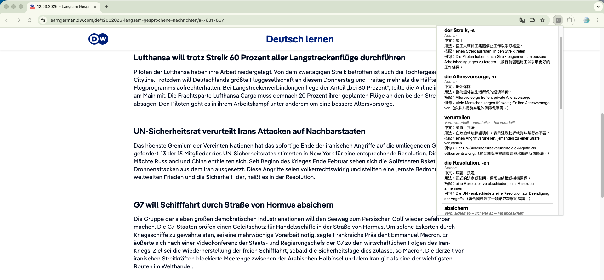
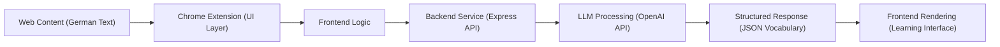

# German AI Vocabulary Extractor 🇩🇪🤖

## 🧩 Demo


A Chrome extension that analyzes German news articles and extracts useful **B2-level vocabulary** using the OpenAI API.

This tool helps German learners quickly identify important vocabulary from real-world articles, including noun articles, plural forms, verb conjugations, and example sentences.

---

## ✨ Features

* Extracts **10 useful B2-level vocabulary words** from German articles
* Displays **noun articles and plural forms**

  * Example: `die Grenze, -n`
* Shows **verb conjugations**

  * Präsens (3rd person)
  * Präteritum (3rd person)
  * Perfekt
* Provides **Traditional Chinese explanations**
* Includes **example sentences with Chinese translations**
* Designed for **news, politics, and economics vocabulary**

---

## 🧠 Example Output

```
verschärfen
Verb: verschärft – verschärfte – hat verschärft
中文：加劇，惡化
用法：指使情況變得更嚴重或更嚴格，常用於政策或衝突。
搭配：Einwanderungspolitik verschärfen
例句：Die Regierung hat die Einwanderungspolitik verschärft.（政府加強了移民政策。）
```

---

## 🏗 Architecture

Chrome Extension → Local Node.js Server → OpenAI API



---


## Architecture Design
This project follows a simple client-server architecture:
- Frontend: Chrome Extension (user interaction)
- Backend: Express API (request handling)
- AI Layer: OpenAI API (language processing)
- Output: Structured JSON for consistent rendering

---

## ⚙️ Tech Stack

* **Chrome Extension (Manifest v3)**
* **Node.js**
* **Express**
* **OpenAI API**
* **Prompt Engineering**
* **JavaScript**

---

## 📂 Project Structure

```
german-ai-extension
│
├─ extension
│   ├─ manifest.json
│   ├─ popup.html
│   └─ popup.js
│
├─ server
│   ├─ server.js
│   ├─ package.json
│   └─ .env
│
└─ README.md
```

---

## 🚀 Setup

### 1. Clone the repository

```
git clone https://github.com/your-username/german-ai-extension.git
cd german-ai-extension
```

### 2. Install server dependencies

```
cd server
npm install
```

### 3. Add your OpenAI API key

Create a `.env` file:

```
OPENAI_API_KEY=your_api_key_here
```

---

### 4. Start the server

```
npx nodemon server.js
```

Server will run at:

```
http://localhost:3000
```

---

### 5. Load the Chrome extension

Open:

```
chrome://extensions
```

Enable **Developer Mode**.

Click **Load unpacked** and select the `extension` folder.

---

## 📚 Use Case

1. Open a German news article
2. Click the extension
3. Press **Analyze**
4. Instantly see important B2 vocabulary extracted from the article

---

## 🎯 Motivation

Learning German through authentic materials can be difficult because articles contain many unfamiliar words.

This tool helps learners quickly identify:

* important vocabulary
* real-world usage
* common collocations
* verb conjugations

It bridges the gap between **reading real German content and structured vocabulary learning**.

---

## 📌 Future Improvements

Possible future features:

* CEFR level detection (B2 / C1)
* Anki flashcard export
* Better article content extraction
* Vocabulary frequency ranking
* Support for multiple languages
