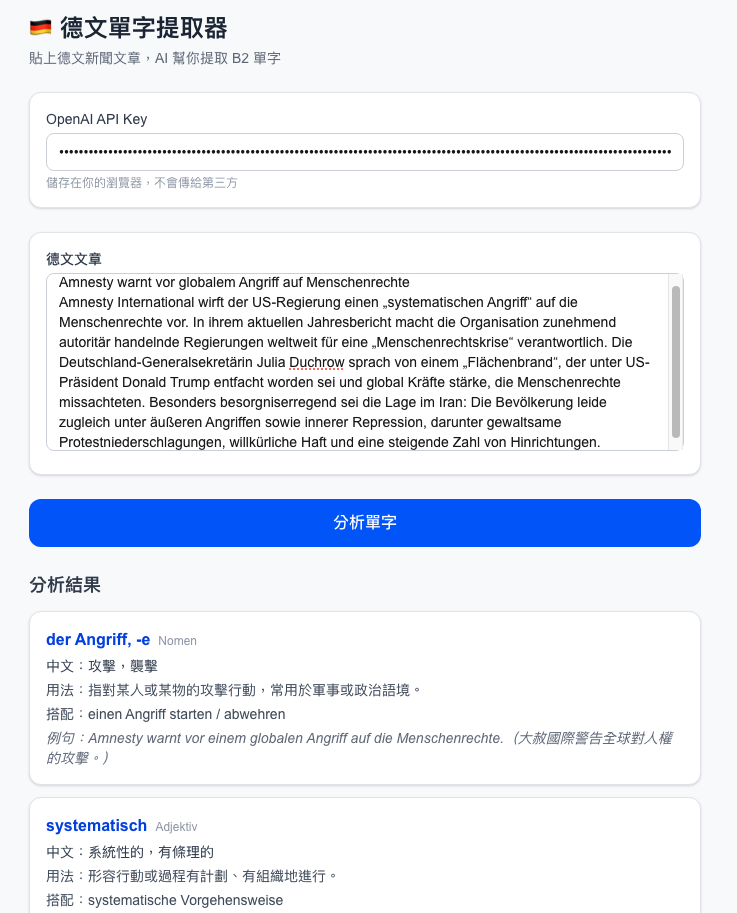
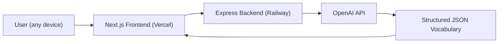

# German AI Vocabulary Extractor 🇩🇪🤖

A **web app** that analyzes German news articles and extracts useful **B2-level vocabulary** using the OpenAI API.

No installation required — open the link on any device and start learning.

🔗 **Live App: [german-ai-extension.vercel.app](https://german-ai-extension.vercel.app)**

---

## 🧩 Demo


---

## ✨ Features

* Extracts **10 useful B2-level vocabulary words** from German articles
* Displays **noun articles and plural forms**

  * Example: `die Grenze, -n`
* Shows **verb conjugations**

  * Präsens (3rd person)
  * Präteritum (3rd person)
  * Perfekt
* Provides **Traditional Chinese explanations**
* Includes **example sentences with Chinese translations**
* Designed for **news, politics, and economics vocabulary**
* Works on **mobile and desktop** — no extension needed
* Your OpenAI API key is stored **locally in your browser only**

---

## 🧠 Example Output

```
verschärfen
Verb: verschärft – verschärfte – hat verschärft
中文：加劇，惡化
用法：指使情況變得更嚴重或更嚴格，常用於政策或衝突。
搭配：Einwanderungspolitik verschärfen
例句：Die Regierung hat die Einwanderungspolitik verschärft.（政府加強了移民政策。）
```

---

## 🏗 Architecture



---

## ⚙️ Tech Stack

| Layer | Technology |
|-------|-----------|
| Frontend | Next.js + Tailwind CSS → Vercel |
| Backend | Node.js + Express → Railway |
| AI | OpenAI API (gpt-4.1-mini) |
| Language | TypeScript / JavaScript |

---

## 📂 Project Structure

```
german-ai-extension
│
├─ frontend              # Next.js web app (deployed to Vercel)
│   ├─ app
│   │   ├─ page.tsx
│   │   ├─ layout.tsx
│   │   └─ globals.css
│   └─ package.json
│
├─ server                # Express API (deployed to Railway)
│   ├─ server.js
│   ├─ package.json
│   └─ .env
│
└─ README.md
```

---

## 🚀 Local Development

### 1. Clone the repository

```bash
git clone https://github.com/jeannineshiu/german-ai-extension.git
cd german-ai-extension
```

### 2. Start the backend

```bash
cd server
npm install
node server.js
```

Server runs at `http://localhost:3000`

### 3. Start the frontend

```bash
cd frontend
npm install
npm run dev
```

App runs at `http://localhost:3001`

### 4. Set frontend env variable

Create `frontend/.env.local`:

```
NEXT_PUBLIC_API_URL=http://localhost:3000
```

---

## 📚 How to Use

1. Open [german-ai-extension.vercel.app](https://german-ai-extension.vercel.app)
2. Enter your **OpenAI API key** (saved in your browser's localStorage)
3. Paste a German news article
4. Press **分析單字**
5. Instantly see 10 B2-level vocabulary words extracted from the article

---

## 🎯 Motivation

Learning German through authentic materials can be difficult because articles contain many unfamiliar words.

This tool helps learners quickly identify:

* important vocabulary
* real-world usage
* common collocations
* verb conjugations

It bridges the gap between **reading real German content and structured vocabulary learning**.

---

## 📌 Future Improvements

* CEFR level detection (B2 / C1)
* Anki flashcard export
* Direct URL input to auto-fetch article content
* Vocabulary frequency ranking
* Save vocabulary history
